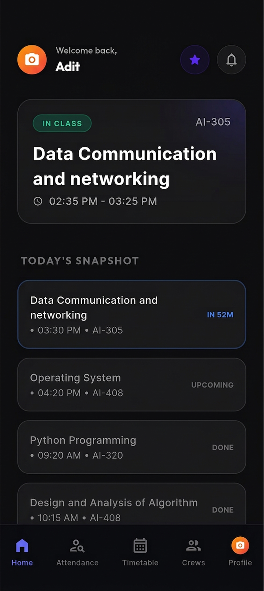
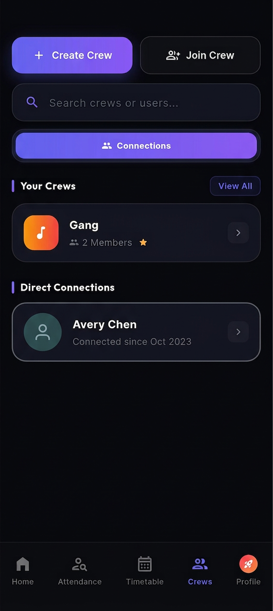
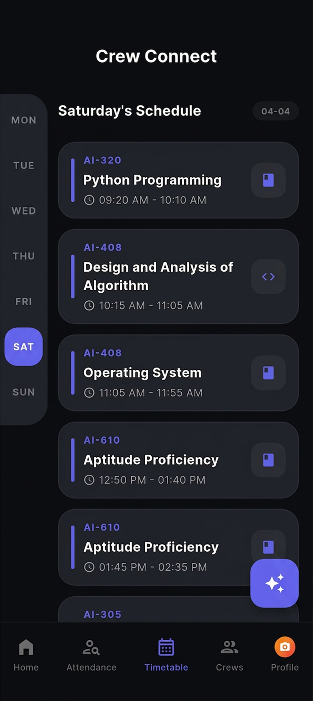
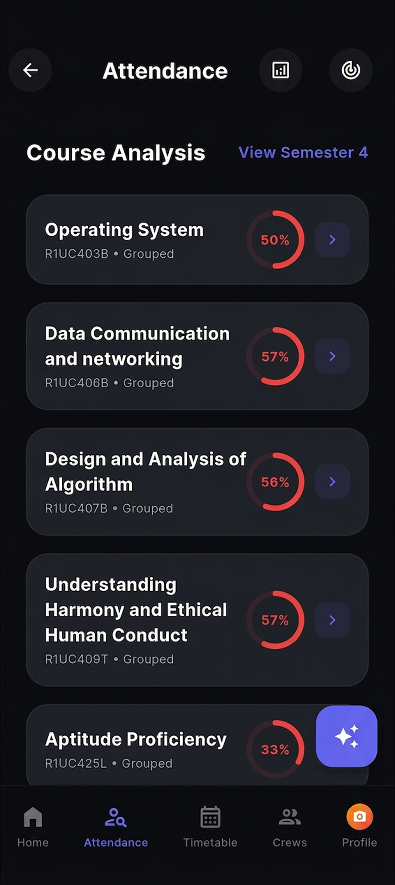
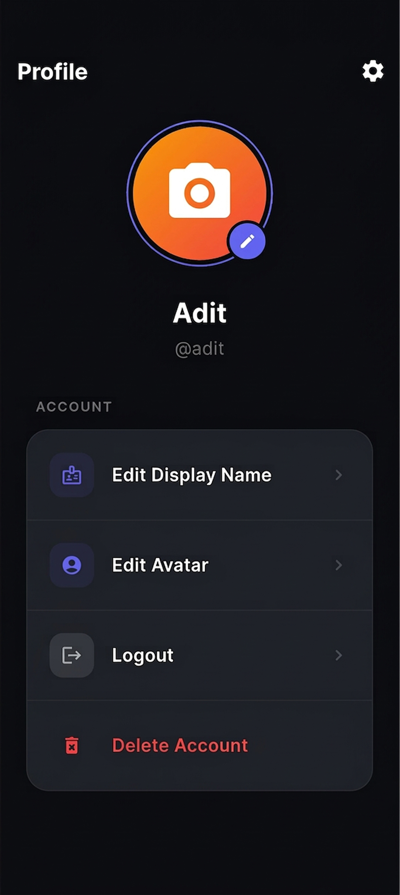

<div align="center">


# CREW CONNECT

**The Social Coordination Layer for Campus Life.**

*Know where your crew is. Sync your schedule. Never miss a moment.*

---

[](https://crew-connect-rosy.vercel.app/)
[](https://drive.google.com/uc?export=download&id=16-YHW1RCBmM7Oom7ZsoVZEaMwep2hKdV)
[](https://crew-connect-rosy.vercel.app/)


</div>

---

## What is CrewConnect?

CrewConnect is a **full-stack, multi-platform social coordination system** built specifically for university students. It bridges the gap between your academic schedule, your social circle, and the chaos of everyday campus life — all within a sleek, offline-capable mobile experience.

> 🎓 Built for and by students at **Galgotias University**.

---

## Core Features

### 👥 Social Circles & Real-Time Presence
The defining feature of CrewConnect. **Crews** are private, invite-only groups where you can see who's in class, who's free, and coordinate on the fly.

- Live status awareness for each crew member
- Direct peer-to-peer connections without social media clutter
- Create, join and manage multiple crews for different contexts (project team, friend group, batch)
- Real-time updates powered by **Socket.io**

### 🔄 EMS Sync — Browser Extension
A dedicated **Chrome/Edge extension** that connects your academic life to CrewConnect automatically.

- One-click extraction of your complete timetable from the **iCloudEMS** portal
- Automated attendance data sync — track your percentages without manual effort
- Runs as a Manifest V3 service worker for minimal resource footprint

### 📶 Offline-First Timetable
Your schedule is too important to depend on a network connection.

- Full timetable persisted to **local device storage** after first sync
- Works without internet — essential for lecture halls and dead zones
- Smart sync on reconnect to keep data fresh

### 📊 Attendance Intelligence
Never miss the 75% threshold again.

- Per-subject attendance analysis with visual progress indicators
- Color-coded risk detection for lectures you can't afford to skip
- Semester-level view with drill-down per course

---

## 📱 Screenshots

<div align="center">
  <table>
    <tr>
      <td align="center">
        <br/>
        <sub><b>Live Feed</b></sub>
      </td>
      <td align="center">
        <br/>
        <sub><b>Social Crews</b></sub>
      </td>
      <td align="center">
        <br/>
        <sub><b>Smart Timetable</b></sub>
      </td>
    </tr>
    <tr>
      <td colspan="3" align="center">
        <table>
          <tr>
            <td align="center">
              <br/>
              <sub><b>Attendance Tracker</b></sub>
            </td>
            <td width="40"></td>
            <td align="center">
              <br/>
              <sub><b>User Profile</b></sub>
            </td>
          </tr>
        </table>
      </td>
    </tr>
  </table>
</div>

---

## 🏗️ Architecture Overview

```
                     ┌──────────────────────────────────┐
                     │        CrewConnect Backend       │
                     │   Node.js · Express · Socket.io  │
                     │         MongoDB Atlas            │
                     └──────────┬────────────┬──────────┘
                                │            │
                   ┌────────────▼──┐    ┌────▼──────────────────┐
                   │  Flutter App  │    │  Web Application      │
                   │  (Mobile)     │    │  (circle-next-app)    │
                   └───────────────┘    └───────────────────────┘
                                                 ▲
                              ┌──────────────────┘
                              │
                   ┌──────────▼──────────┐
                   │  Browser Extension  │
                   │  EMS Portal → API   │
                   └─────────────────────┘
```

---

## 🛠️ Tech Stack Deep Dive

| Layer | Technology | Purpose |
| :--- | :--- | :--- |
| **Mobile** | Flutter, Dart, Provider | Cross-platform native app |
| **Web App** | Next.js 16, React 19 | Browser-based experience |
| **Showcase** | Next.js 16, Tailwind CSS 4, Framer Motion | Marketing & landing |
| **Extension** | Manifest V3, Vanilla JS | EMS data extraction |
| **API Server** | Node.js, Express.js | REST + WebSocket backend |
| **Realtime** | Socket.io | Live presence & sync |
| **Database** | MongoDB Atlas | Persistent data store |
| **Auth** | Firebase Auth + JWT | Secure session management |
| **Deployment** | Vercel (Frontend), Render (Backend) | Cloud hosting |

---

## 🔒 Security & Infrastructure

- JWT-based authentication with refresh token rotation
- Credentialed CORS policy — strict origin allowlist
- Rate limiting on all public API endpoints
- Firebase Auth integration for identity management
- Dual-database strategy: `crewconnect_social` / `crewconnect_company` namespaces

---

<div align="center">
  <br/>
  <strong>CrewConnect — Unified Synergy</strong>
  <br/>
  <sub>© 2026 CrewConnect · Made with ❤️ for university students</sub>
</div>
